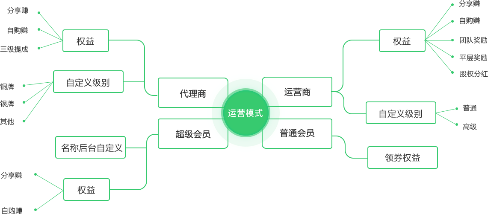

# 淘客外卖返利CPS系统(可定制开发)

#### 介绍
公众号 + 小程序 
支持淘宝/京东/拼多多/唯品会
支持饿了么/美团CPS
支持滴滴/高德/花小猪
支持社交分销

#### 体验效果
小程序端：

管理后台：https://pub.yzy666.cn/#/login
账号：18688888888
密码：123456

#### 软件架构
软件架构说明

#### 安装教程

1.  xxxx
2.  xxxx
3.  xxxx

#### 使用说明
淘客外卖返利CPS系统

#### 联系作者

QQ:526261113

#### 参与贡献

1.  Fork 本仓库
2.  新建 Feat_xxx 分支
3.  提交代码
4.  新建 Pull Request

#### 特技

1.  使用 Readme\_XXX.md 来支持不同的语言，例如 Readme\_en.md, Readme\_zh.md
2.  Gitee 官方博客 [blog.gitee.com](https://blog.gitee.com)
3.  你可以 [https://gitee.com/explore](https://gitee.com/explore) 这个地址来了解 Gitee 上的优秀开源项目
4.  [GVP](https://gitee.com/gvp) 全称是 Gitee 最有价值开源项目，是综合评定出的优秀开源项目
5.  Gitee 官方提供的使用手册 [https://gitee.com/help](https://gitee.com/help)
6.  Gitee 封面人物是一档用来展示 Gitee 会员风采的栏目 [https://gitee.com/gitee-stars/](https://gitee.com/gitee-stars/)
